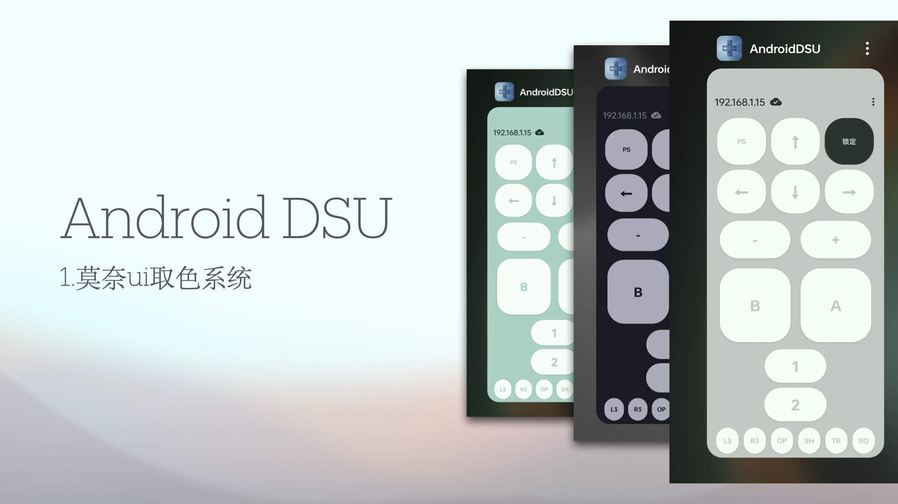
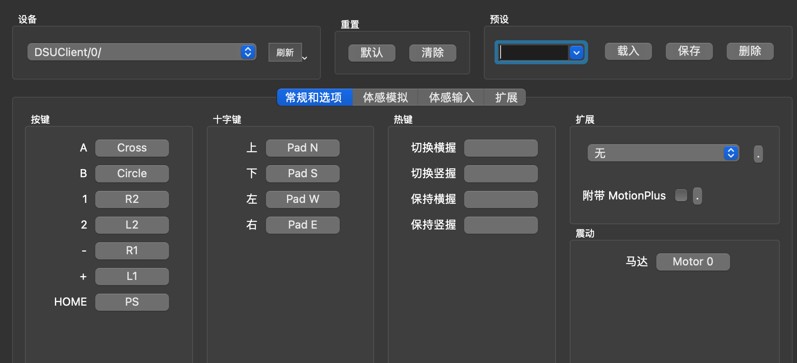

# AndroidDSU

Android Server For Cemuhook Protocol（DSU Dualshock UDP）

<!-- PROJECT SHIELDS -->

[![Contributors][contributors-shield]][contributors-url]
[![Forks][forks-shield]][forks-url]
[![Stargazers][stars-shield]][stars-url]
[![Issues][issues-shield]][issues-url]
[![MIT License][license-shield]][license-url]

<!-- PROJECT LOGO -->
 

  

<h3 align="center">AndroidDSU</h3>
  

    基于Cemuhook协议的安卓实现例
     
    <a href="https://github.com/PlayXboxtion963/AndroidDSU/releases">下载发行版 ⏬ </a>
    ·
    <a href="https://github.com/PlayXboxtion963/AndroidDSU/issues">报告BUG 🐛</a>
  
  

## 目录

- [软件介绍](#软件介绍)
    - [功能说明](#功能)
    - [UI](#UI与界面)
    - [支持的模拟器](#模拟器)   
- [环境](#环境)
- [鸣谢](#鸣谢)
- [版权说明](#版权说明)
### 软件介绍

###### 功能

1. 支持了DSU协议中的所有按键
2. 支持手机陀螺仪与加速度计数据
3. 支持了DSU Unofficial的震动马达实现
4. 莫奈取色Android规范的UI
5. Android实体音量按键的支持
6. 双虚拟摇杆的支持

###### UI与界面

1. 莫奈自动颜色适配

  

2. 全按键 + 线性震动马达支持

  

3. 自定义选项

  

###### 环境

Android 5.0 以上 + Cemu/Dolphine/Yuzu等等....

###### 鸣谢
1.感谢https://github.com/breeze2/dsu-controller-guides/releases/提供的非官方支持震动特性的模拟器。

2.感谢https://github.com/v1993/cemuhook-protocol 提供的完整协议。

### 版权说明

该项目签署了MIT 授权许可，详情请参阅 [LICENSE](https://github.com/PlayXboxtion963/AndroidDSU/blob/master/LICENSE)

<!-- links -->
[your-project-path]:PlayXboxtion963/AndroidDSU
[contributors-shield]: https://img.shields.io/github/contributors/PlayXboxtion963/AndroidDSU.svg?style=flat-square
[contributors-url]: https://github.com/PlayXboxtion963/AndroidDSU/graphs/contributors
[forks-shield]: https://img.shields.io/github/forks/PlayXboxtion963/AndroidDSU.svg?style=flat-square
[forks-url]: https://github.com/PlayXboxtion963/AndroidDSU/network/members
[stars-shield]: https://img.shields.io/github/stars/PlayXboxtion963/AndroidDSU.svg?style=flat-square
[stars-url]: https://github.com/PlayXboxtion963/AndroidDSU/stargazers
[issues-shield]: https://img.shields.io/github/issues/PlayXboxtion963/AndroidDSU.svg?style=flat-square
[issues-url]: https://img.shields.io/github/issues/PlayXboxtion963/AndroidDSU.svg
[license-shield]: https://img.shields.io/github/license/PlayXboxtion963/AndroidDSU.svg?style=flat-square
[license-url]: https://github.com/PlayXboxtion963/AndroidDSU/blob/master/LICENSE

